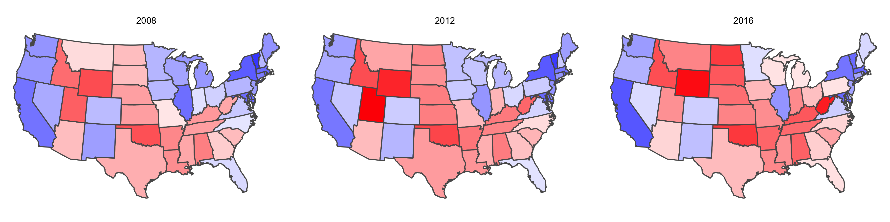
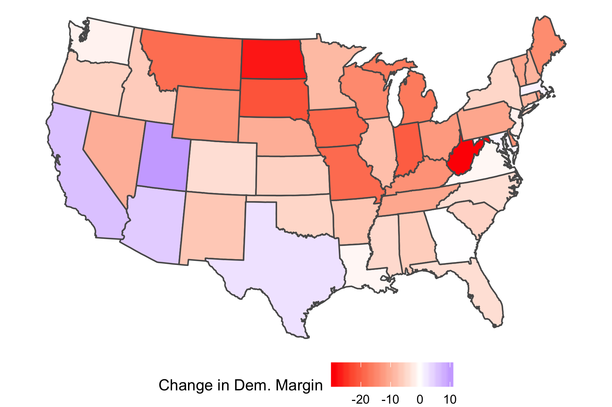
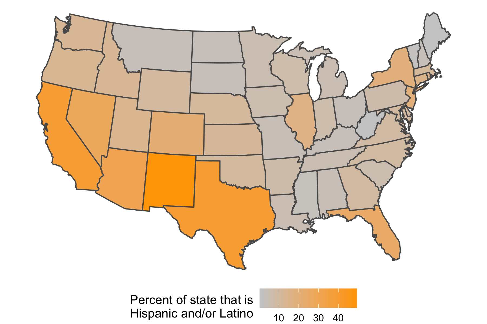
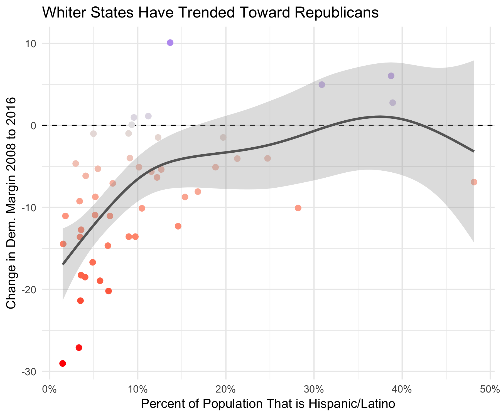
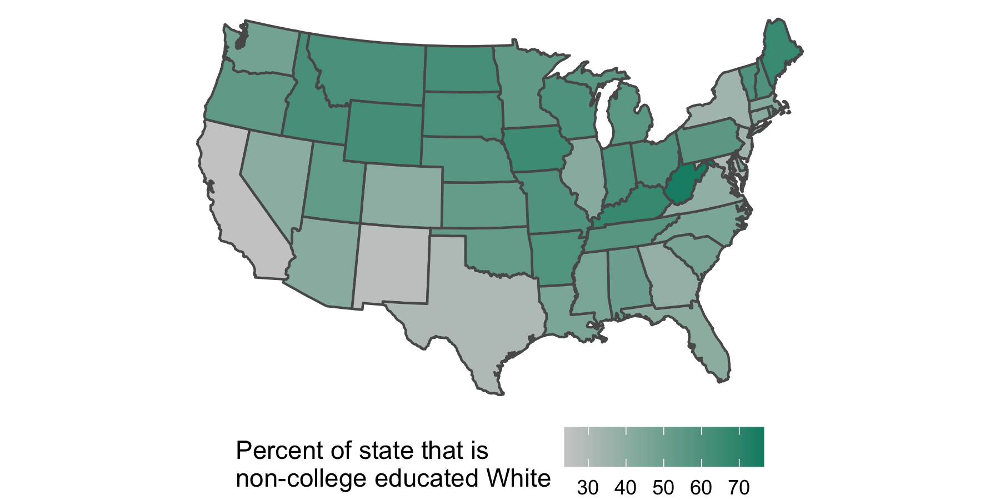
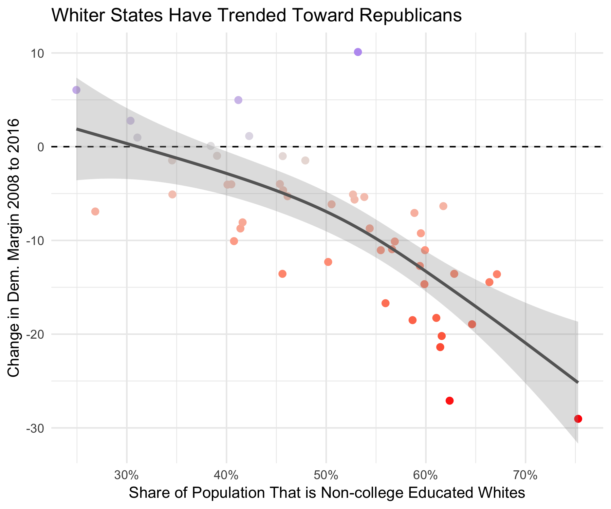
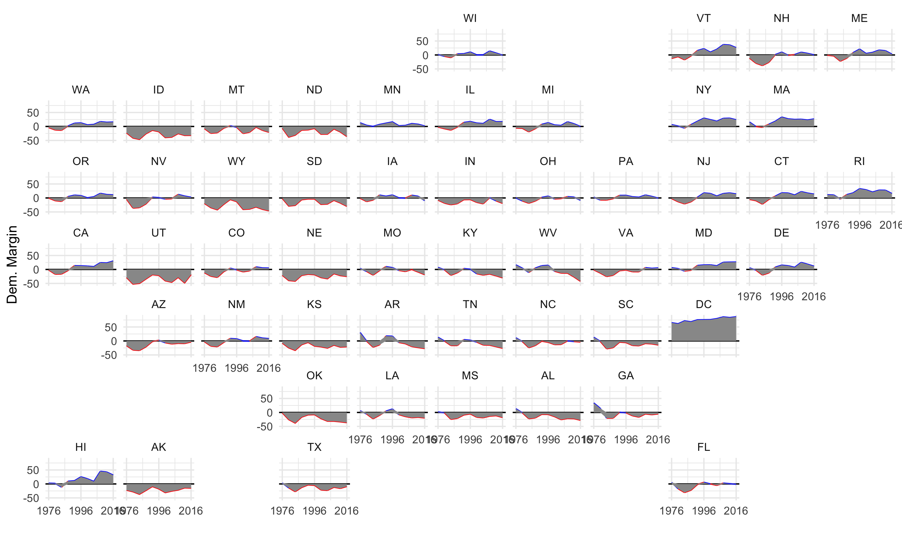

```{r setup, include=FALSE}
# load up the necessary packages 

library(tint)
library(knitr)
# invalidate cache when the package version changes
knitr::opts_chunk$set(tidy = FALSE, cache.extra = packageVersion('tint'),
                     echo = F,warning = F,message = F)

# update the politicaldata package to make sure we've got everything we need
#remotes::install_github('elliottmorris/politicaldata',upgrade = 'never')

# source the table of contents file
source("render_toc.R")
```


\  


_A work in progress. Read more about the project [here](https://www.thecrosstab.com/project/r-politics-guide/) and [here](#to-come)._


\  


```{r  fig.fullwidth = TRUE,  fig.cap = "CBS News anchor Walter Cronkite and the UNIVAC I, which in 1952 provided the statistical prowess to make the first ever live predictions of election night. _Source: NPR_."}
knitr::include_graphics('figures/univac_cronkite.png',dpi = 60)
```


\  
\  


---


\  


# Contents


```{r toc, echo=FALSE} 
render_toc("guide.Rmd",toc_header_name="Contents",toc_depth=1)
```


\  


---


\  


# Preface: Learning About Politics Through Data (and Coding) {#preface}


`r tint::newthought("In this short text,")` I outline some of my most commonly-deployed tools for deriving, and conveying, data-driven insights about politics with the R programming language. This is not a general-purpose introduction to polling, election statistics, etc. but rather a guide for analyst to learn about common sources of political data and build habits for efficient analysis. A slightly deeper than surface-level knowledge of the language will make this book much more accissible ^[If you're just getting started with R, you should start with the excellent **free** online text [_R for Data Science_](https://r4ds.had.co.nz) by Garrett Grolemund and Hadley Wickham.], though it is generally suitable for very new users. If you want to skip the narration and get to the programming, go ahead and skip to the portion on presidential elections.


I have been doing "data journalism," primarily about politics, for nearly 4 years now. What I've learned along the way is that it pays to be clear. However, many obstacles get in the way of clarity; deadlines can rush our work, small coding problems can bottleneck productivity, and finding data is a perennial struggle. My aim with this work is to minimize some of these obstacles. Through basic but illustrative examples, you can learn how to tackle coding problems step-by-step, with clarity and simplicity. I place two suggestions on the table to accomplish this.


First, I use a tidy(verse)-first approach to R coding that lends itself well to the pursuit of making programming more accessible. Second, By releasing all the data used throughough the text in my R package `politicaldata`^[You can install `politicaldata` and access all the data I use in this tutorial [via GitHub](https://github.com/elliottmorris/politicaldata)] I have largely eliminated stress over finding necessary information for analysis. This document illustrates how this is done.


Now, allow me to make a bold assumption. If you're here, you likely already know the value of data, and likely understand how it leads to making better political conclusions. I'd like to make my own "philosophy" on the matter clear, so I begin now with just a few paragraphs on _why_ I think using data to analyze politics is massively useful. Then, we'll dive head-first into _how_ that can accomplished. To be clear: after the introduction, this document is primarily one about R programming If you want to skip ahead to the code, it starts [here](#mapping-pres-elections).

_[Get the materials on GitHub](https://github.com/elliottmorris/R-for-political-data) _


## Notes

This document was prepared in the style of Edward Tufte using the [tint](http://dirk.eddelbuettel.com/code/tint.html) template for [rmarkdown](https://rmarkdown.rstudio.com) documents. I could have chosen to render the book in [bookdown](https://bookdown.org), but there is not yet a good tufte-esqe template for the online HTML generator gitbook. I think the single page approach works better anyhow, especially given that this is not a book. The code, figures, etc. are all contained in the same document and can be found [here](https://github.com/elliottmorris/R-for-political-data).

Onward.


<br />


# Introduction: What Data Offer Us {#introduction}


`r tint::newthought("Let me first offer")` an old story from the early days of American election statistics that illustrates beautifully why data are useful in covering the subject:


The year is 1952, and World War II super-General Dwight D Eisenhower was facing off against Illinois Governor Adlai Stevenson for the presidency. Pundits went in to the night thinking that Stevenson was ahead, an impression given to them largely by public opinion polling (which, in its earlier days, was not as scientifically sound as it is today). As the votes begin to roll in, a state-of-the-art computer called UNIVAC --- which could fill your entire kitchen and living room, if you were lucky --- predicted early that Eisenhower would win the election with 438 electoral votes, giving him a 100% chance of defeating Stevenson. 


```{r  fig.margin = TRUE, fig.cap = "CBS News Reporter Charles Collingwood and the UNIVAC I. _Source: Computer History Museum_."}

```


CBS News didn't air the prediction. Instead, Sig Mickelson directed the network to keep focusing its coverage on the topline reports and spotlights on particular states. Walter Cronkite and Charles Collingwood didn't review UNIVAC's predictions until hours later They might as well have waited decades; in election night coverage, even a minute can cost your ratings dearly.


The contest would soon clearly tip towards Ike, who won with 442 Electorate Votes to Stevenson's 89. If only the network had listened to their "electronic brain," they would have been able to call the contest hours earlier with incredible precision. Offering an explanation for why UNIVAC was re-calibrated during the middle of the coverage to avoid its hyperconfident prediction, Remington Rand representative Art Draper would later appear on television and announce "It was right. We were wrong. Next year we'll believe it."


"It was right. We were wrong." Such are the words of people who doubt the fundamental predictiveness of political data. In 2011, the predictions of 26 pundits were scored by a group of students at Hamilton College. They were found to be no more accurate than a coin flip^[Read Elspeth Reeve, 2011, ["Seeking Justice for Inaccurate Pundits,"](https://www.theatlantic.com/business/archive/2011/05/seeking-justice-bad-pundits/350296/) _The Atlantic_.]. Five years earlier, political scientist and forecaster extraordinair Phillip Tetlock generated headlines that characterized pundits as "no better than a dart-throwing chimp" when he published his book _[Expert Political Judgement: How Good Is It? How Can We Know?](https://www.amazon.com/Expert-Political-Judgment-Good-Know/dp/0691128715)_. The age of pundits was coming to pass. Nearing the 2020 election, the transition seems to be nearing completion. As political scientist Jennifer Victor argues, there's a lot of value in "use[ing] big data to explain politics"^[Read Jennifer Victor, 2018, ["Use big data to explain politics rather than predict it,"](https://www.vox.com/mischiefs-of-faction/2018/2/5/16973996/big-data-explain-politics) _Vox/Mischeifs of Faction_.] (though I take issue with the second half of her article's title, "...rather than predict it"). To Dr Victor I have responded: why not both?


Such is the world we live in now, when analysts with statistical prowess rule the industry of election analysis. You've likely heard of Nate Silver, whose website FiveThirtyEight is a staple of the campaign cycle and the target of everyone's constant page-refreshing form Labor Day til Election Day. Data is here to stay, and it has toppled the pundits (though, to be sure, some are evidently [here to stay](https://www.foxnews.com/opinion/newt-gingrich-get-ready-for-the-great-political-surprise-of-2018)). 


## Getting Technical


`r tint::newthought("It thus behooves politics-watchers")` to learn about the data that underpin almost all of that coverage. This white paper of sorts serves the purpose to introduce would-be political data analysts to the world of capability offered up to them in the R programming language and accompanying data sources. Using a package of data and functions that I designed specifically for this purpose^[Get my package for political data analysis, `politicaldata`, [on GitHub](https://github.com/elliottmorris/politicaldata)], readers will now embark on a series of tutorials that will give them all the information they need to wrangle their way to insightful political conclusions that can beat the dart-throwing chimps (er, pundits).


```{r fig.margin=TRUE, fig.cap='The banner for my course ["Analyzing Election and Polling Data in R"](https://campus.datacamp.com/courses/analyzing-election-and-polling-data-in-r) at DataCamp.com.'}


```


This whitepaper of sorts will henceforth switch into an interwoven text of regular old english and R. If you're looking for a guided introduction to the language, check out my interactive tutorial on DataCamp.com, ["Analyzing Election and Polling Data in R"](https://campus.datacamp.com/courses/analyzing-election-and-polling-data-in-r). The first chapter is free!


<br />


# Dive in: Mapping Presidential Elections {#mapping-pres-elections}


`r tint::newthought("Presdential elections are the big fish")` in the pond of political journalism. Campaigns and super PACs spend billions of dollars in their efforts to get elected. Media outlets absorb much of this cash in ad revenue and in turn spend an enormous amount of time and resources covering the campaigns,^[See Nicholas Confessore and Karen Yourish, 2016, ["$2 Billion Worth of Free Media for Donald Trump,"](https://www.nytimes.com/2016/03/16/upshot/measuring-donald-trumps-mammoth-advantage-in-free-media.html) _New York Times_.] both on air and during commercials. In recent years, spending on and attention to presidential elections has only continued to increase.


The online world of political journalism has also exploded in popularity. With data sources and statistical/graphical programming tools only getting easier to use, the barrier of entry into the space has been dramatically lowered. For R users, this could not be easier. 


## Plotting state-level election results


`r tint::newthought("Here I show you how")` to import election results from my `politicaldata` package, combine it with a map, and plot it with the popular `ggplot2` package from Hadley Wickham and others:


```{r echo=TRUE}
# wrangle presidential eleciton data
library(dplyr)
library(politicaldata)

pres <- politicaldata::pres_results

pres <- pres %>% 
  filter(year%in% 2008:2016)


pres$state_name = tolower(state.name[match(pres$state,state.abb)]) # we need the full name of the state to join with the map


# get map data
library(maps)
library(sf)
pres_map <- maps::map("state", plot = FALSE, fill = TRUE) # acquirig the data frame

pres_map <- sf::st_as_sf(pres_map) # changing the lat-long format to a simple feature object

names(pres_map) <- c("geometry","state_name")

pres_map <- pres_map %>% filter(state_name != 'district of columbia')

# combine with election data
pres_map <- pres_map %>% 
  left_join(pres,by = 'state_name') # joining the map with the political data

# plotting with ggplot2
library(ggplot2)
gg <- ggplot(pres_map,
             aes(fill=dem-rep>0),
             col='black') +
  geom_sf(aes(alpha=abs(dem-rep))) +
  coord_sf(crs = "+proj=aea +lat_1=25 +lat_2=50 +lon_0=-100",ndiscr = 0) + # change the projection from mercator (blegh)
  scale_fill_manual(values=c("TRUE"="blue","FALSE"="red")) +
  scale_alpha(range=c(0.1,1)) +
  facet_wrap(~year) +
  theme_void() +
  theme(legend.position='none')

ggsave(plot = gg,filename = 'figures/us_election_2008_2012_2016.png',width=12,height=3,units='in')

```


The result is a beautiful three-paneled map of the 2008, 2012, and 2016 US presidential elections. the `alpha` parameter in `geom_sf` allows us to shade the closer contests with more transparency than the solidly-decided ones.


```{r fig.fullwidth = TRUE, fig.cap="US presidential election results from 2008 to 2016."}

```


Comparing across the facets, you can also see how the states have changed over time. For a more clear look at how states have changed, we could just show one map of the difference between Democrats' margins in 2016 vs 2008:


```{r echo=TRUE}
# get rid of 2012, compute change, then filter to 2016
pres_map_change <- pres_map %>% 
  filter(year!=2012) %>%
  group_by(state) %>%
  mutate(dem_gain = dem-rep - (lag(dem)-lag(rep))) %>%
  filter(year==2016)


# plotting with ggplot2
library(ggplot2)
gg <- ggplot(pres_map_change,
             aes(fill=dem_gain*100),
             col='black') +
  geom_sf() +
  coord_sf(crs = "+proj=aea +lat_1=25 +lat_2=50 +lon_0=-100",ndiscr = 0) + # change the projection from mercator (blegh)
  scale_fill_gradient2("Change in Dem. Margin",
                    high='blue',low='red',mid='white',midpoint=0) +
  theme_void() +
  guides('alpha'='none') +
  theme(legend.position='bottom')

ggsave(plot = gg,filename = 'figures/us_election_swing_2008_2016.png', width=6,height=4,units='in')
```


```{r fig.cap="Change in Democratic vote margin from 2008 to 2016."}

```


This make clear where Democrats lost ground from Obama's first election to Trump's. 


One thing stands out: there's a whole lot of red on the map, indicating that most states moved to the right over the past decade. But across the southwest, in Texas, and in Georgia the opposite is true. Why did these stated get bluer? One simple hypothesis is that hispanics in these states are becoming both more likely to vote and more Democratic-leaning over time, as the old guard of conservative, largely catholic hispanics is replaced by the younger, liberal cohort. 


With data from the [NHGIS](https://www.nhgis.org), we can check whether this hypothesis looks true. First, I simply import the data, merge it with the `pres_map_change` object from above and map it with `ggplot2`.


```{r echo=TRUE}
# import census estiamtes from the American community survey
state_hispanic <- read.csv("data/acs_hispanic_pct.csv")

state_hispanic$state_name <- tolower(state_hispanic$state_name)

# take a look with the kable() function for making nice rmarkdown tables
kable(state_hispanic[1:5,], caption = 'Percent Hispanic/Latino, by state.') 
```


```{r echo=T}
# combine with presidential election results and get rid of mapping data
pres_hispanic <- pres_map_change %>% 
  left_join(state_hispanic,by='state_name')


# plotting with ggplot2
library(ggplot2)
gg <- ggplot(pres_hispanic,
             aes(fill=hispanic.pct*100),
             col='black') +
  geom_sf() +
  coord_sf(crs = "+proj=aea +lat_1=25 +lat_2=50 +lon_0=-100",ndiscr = 0) + # change the projection from mercator (blegh)
  scale_fill_gradient("Percent of state that is\nHispanic and/or Latino",
                    high='orange',low='gray80') +
  theme_void()  +
  theme(legend.position='bottom')

ggsave(plot = gg,filename = 'figures/hispanic_share_pop.png', width=6,height=4,units='in')

```


This code makes the a map that shows, on a scale from gray to orange, which states have lower to higher share of hispanics living in them. 


```{r fig.margin=TRUE, fig.cap="Percent Hispanic/Latino, by state."}

```


There are some striking similarites between this map and the map of change in presidential vote margins from 2008 and 2016! However, it helps to see these things as they relate to each other _on the same plot_, rather than just comparing the maps ad-hoc. How do we do that?


Using a scatterplot is the best bet. And because we don't know if the relationship between the variables is linear, quadratic, logarithmic or something else then we can use a different tool to draw the trend line for us. Below, I plot the relationship between hispanic population precentage and the change in Democrats' presidential performance by state using the `ggplot2` package and draw a trendline with a [generalized additive model](https://www.stat.cmu.edu/~cshalizi/uADA/12/lectures/ch13.pdf), which is just a fancy model where the outcome variable depends on a smoothing of the independent variable. 


```{r echo=TRUE}
# plot a scatter plot with a GAM smooth, y ~ s(x)
gg <- ggplot(pres_hispanic,aes(x=hispanic.pct,y=dem_gain*100)) +
  geom_hline(yintercept=0,linetype=2) +
  geom_point(aes(col=dem_gain),size=2) +
  geom_smooth(method='gam',formula = y~s(x),col='gray40',alpha=0.3) +
  scale_x_continuous(labels=scales::percent_format(2)) +
  scale_color_gradient2("Change in Dem. Margin",
                       high='blue',low='red',mid='gray90',midpoint=0) +
  theme_minimal() +
  labs(title="Whiter States Have Trended Toward Republicans",
       x='Percent of Population That is Hispanic/Latino',
       y='Change in Dem. Margin 2008 to 2016') +
  theme(legend.position = 'none')


ggsave(plot = gg,filename = 'figures/hispanics_dem_diff_2008_2016.png', width=6,height=5,units='in')

```


```{r, fig.cap="There is a clear state-level relationship between having a large hispanic population and moving toward the Democrats from 2008 to 2016. The trend is a GAM fit using the [mgcv](https://cran.r-project.org/web/packages/mgcv/index.html) package."}

```

From the fit between the points, there's clear evidence that states with more hispanics resisted the urge to move right between 2008 and 2016. But perhaps we're looking at the wrong thing here. Rather than looking at the share of a state that is Hispanic/Latino, maybe we should take into account that other non-white groups could have had similar population dynamics and instead simply look at the share of a state that is white. Maybe beyond that, we can look at the share of a state that is white _and_ does not hold a college degree, as political science evidence is pretty clear^[See Schaffner, Brian, Matthew MacWilliams and Tatishe Nteta, 2018, ["Understanding White Polarization in the 2016 Vote for President: The Sobering Role of Sexism and Racism,"](https://onlinelibrary.wiley.com/doi/full/10.1002/polq.12737) _Political Science Quarterly_.] on the relationship between having a college education and leaning Democratic.

`r tint::margin_note('Special thanks to Jason Timm for the [tutorial](https://github.com/jaytimm/American_political_data_and_R) on getting census data into R.')`

We take the same approach as above, except this time, I'm downloading the data from the Census Bureau directly into R. To do this, I use the `tidycensus` package. If you want to replicate the work you will need to save your own API key to your R environment.The  guide for how to use tidycensus can be found [in the documentation](https://walkerke.github.io/tidycensus/articles/basic-usage.html) written by Kyle Walker. You'll also need to get an API key from [The Census Bureau](https://api.census.gov/data/key_signup.html).

First, we'll get the census data. Then, we combine the census data with the `pres_map_change` data.frame that we made earlier. Go up a few blocks if you've forgotten how that was made. Finally, we use the now-familar `ggplot2` syntax for creating maps with simple feature objects, aka `geom_sf()`.


```{r echo=TRUE}
# import tidycensus and API key
library(tidycensus)
invisible(Sys.getenv("CENSUS_API_KEY"))

# make a table of race codes 
race_table <- data.frame(
  code = c('A', 'B', 'C', 'D', 'E',
          'F', 'G', 'H', 'I'),
  race= c('WHITE ALONE', 'BLACK OR AFRICAN AMERICAN ALONE',
          'AMERICAN INDIAN OR ALASKAN NATIVE ALONE',
          'ASIAN ALONE', 
          'NATIVE HAWAIIAN AND OTHER PACIFIC ISLANDER ALONE', 
          'SOME OTHER RACE ALONE', 'TWO OR MORE RACES',
          'WHITE ALONE, NOT HISPANIC OR LATINO',
          'HISPANC OR LATINO'),
  stringsAsFactors=FALSE)


# get the appropriate variables from the ACS
var_list <- tidycensus::load_variables(2017, "acs5")

search_vars <- var_list[grepl('C1500', var_list$name),]


# import census estiamtes from the American community survey
acs_data.raw <- tidycensus::get_acs(geography = 'state',
                            variables = search_vars$name,
                            summary_var = 'B15002_001',
                            year = 2017,
                            survey = 'acs5')


# add variable names and filter to the educational breakdowns
acs_data <- acs_data.raw %>%
  left_join(dplyr::rename(search_vars, variable = name)) %>% # attach variable names
  filter(!grepl('Total$|Female$|Male$', label)) %>% # get rid of the totals
  mutate(gender = ifelse(grepl('Male', label), 'Male', 'Female'),
         label = gsub('^Estimate.*!!', '', label),
         code = gsub('(C[0-9]+)([A-Z])(_[0-9]+.$)', 
                     '\\2', 
                     variable))

# add race codes
acs_data <- acs_data %>%
  left_join (race_table) %>%
  select(state_name=NAME, label, gender, race, estimate:summary_moe)

# compute the percentages for each level
state_white_college <-  acs_data %>% 
  filter(race == 'WHITE ALONE, NOT HISPANIC OR LATINO') %>%
  group_by(state_name,label) %>%
  summarize(estimate = sum(estimate), 
            summary_est = mean(summary_est)) %>%
  mutate(percent = estimate / summary_est) 

# now just get the col/non-col breakown
state_white_college <- state_white_college %>%
  mutate(college = case_when(label == "Bachelor's degree or higher" ~ "college",
                             TRUE ~ "non-college")) %>%
  group_by(state_name,college) %>%
  summarise(percent = sum(percent))

# get the state abbreviation
state_white_college$state <- state.abb[match(state_white_college$state_name,state.name)] 

# filter out puerto rico and dc
state_white_college <- state_white_college %>%
  filter(!is.na(state))

# pull just the non-college numbers
state_white_college <- state_white_college %>%
  filter(college == 'non-college')

# combine with presidential election results and get rid of mapping data
pres_college <- pres_map_change %>% 
  left_join(state_white_college,by='state')


# plotting with ggplot2
library(ggplot2)
gg <- ggplot(pres_college,
             aes(fill=percent*100),
             col='black') +
  geom_sf() +
  coord_sf(crs = "+proj=aea +lat_1=25 +lat_2=50 +lon_0=-100",ndiscr = 0) + # change the projection from mercator (blegh)
  scale_fill_gradient("Percent of state that is\nnon-college educated White",
                    high='#138D75',low='gray80') +
  theme_void()  +
  theme(legend.position='bottom')

# save the plot
ggsave(plot = gg,filename = 'figures/noncollege_white_share_pop.png', width=6,height=3,units='in')

```


Here's the map of the percentage of population that is whites without a college degree broken down by state state:

```{r, fig.cap="Percent non-college educated White, by state."}

```

And the relationship between non-college whites and swing to Clinton/Trump by state:

```{r echo=T}
# plot a scatter plot with a GAM smooth, y ~ s(x)
gg <- ggplot(pres_college,aes(x=percent,y=dem_gain*100)) +
  geom_hline(yintercept=0,linetype=2) +
  geom_point(aes(col=dem_gain),size=2) +
  geom_smooth(method='gam',formula = y~s(x),col='gray40',alpha=0.3) +
  scale_x_continuous(labels=scales::percent_format(2)) +
  scale_color_gradient2("Change in Dem. Margin",
                       high='blue',low='red',mid='gray90',midpoint=0) +
  theme_minimal() +
  labs(title="Whiter States Have Trended Toward Republicans",
       x='Share of Population That is Non-college Educated Whites',
       y='Change in Dem. Margin 2008 to 2016') +
  theme(legend.position = 'none')


ggsave(plot = gg,filename = 'figures/noncollege_whites_dem_diff_2008_2016.png', width=6,height=5,units='in')
```


```{r, fig.cap="Percent non-college educated White and percentage-point swing toward Democrats from 2008 to 2016, by state."}

```


Immediately, it looks like this trend is much better (you can tell because the points match up better; look how the shaded area of the fit line, which represents the standard error of the fit, is smaller) than the one between hispanic population and swings in vote margins. There's more to be done here --- including combining both variables in a GAM and showing the predicted swings in vote margin alongside the actual values! --- but we will wait to walk through them until later.


The efficient application of easy tools like these --- mapping and trend-fitting --- to data made readily-available by package development is what makes R such a beautiful environment to program in.


The 2016 eleciton might also be explained by state-level trends in either direction. West Virginia, for example, has been leaning more to the right of the nation for every election cycle since the 1990s. Suppose you wanted to see the trend in US presidential elections for every state for the past 4 decades; We can visualize the data from `politicaldata` with the `geofacet` package, which creates a plot for every state and facets them in a familiar map arrangements. See this code for how this is accomplished:


```{r echo=TRUE}
library(geofacet)
pres_history <- politicaldata::pres_results

gg <- ggplot(pres_history, aes(x=year,y=(dem-rep)*100)) +
  geom_hline(yintercept=0) +
  geom_line(aes(col=dem-rep>0,group=state)) +
  geom_area(fill='gray60') +
  facet_geo(~state) + # specify that you want to facet by state, and arrange in corresponding goegraphic order
  theme_minimal() +
  scale_color_manual(values = c("TRUE"='blue',"FALSE"='red')) +
  scale_x_continuous(breaks=c(1976,1996,2016)) +
  theme(legend.position='none') +
  labs(x="",y="Dem. Margin")

ggsave(plot = gg,filename = 'figures/pres_history_ggfacet.png', width=10,height=6,units='in')

```


```{r, fig.fullwidth=T, fig.cap="Democratic margin in US presidential election by state, 1976-2016."}

```


...


\  
\  


# To come... {#to-come}


There's much more to learn here, and I'll be adding to this document until I'm satisfied that it covers most of the tasks of political analysis(or at least those that a journalist or lower-level data scientist and political scientist would deal with). Here's what else I plan on adding, in a more structured way than the attention-grabbing examples above:


*A (tentative) road-map:*

- Different methods for aggregating polling toplines
- Visualizing polling averages
- Computing summary statistics for survey data
- Modeling and visualizing survey data
- Visualizing congressional election results
- Combining demographic and election data
- Exploring lawmakers' political ideologies


For those asking, I probably won't get into election prediction here. In the interests of accessibility and efficient use of time this decision is probably for the best.
